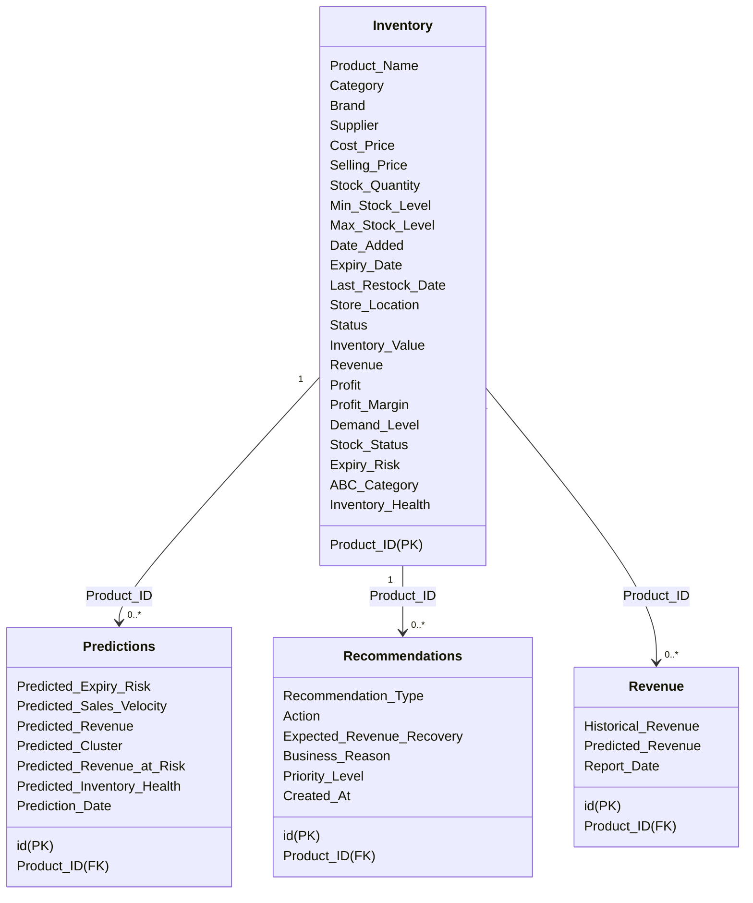

# Power BI Dashboard Specification - SmartInventory AI

This document details the schema definitions, DAX calculations, visual layouts, and navigation structure for implementing the executive-level Power BI Dashboard for **SmartInventory AI – AI-Powered Revenue Recovery and Inventory Intelligence System**.

---

## 1. Data Model & Relationships

Power BI should import the dataset from MySQL (production) or the SQLite database (local development) via SQLAlchemy/ODBC. The tables are configured in a star-schema-like relationship:



---

## 2. Core DAX Measures

Create a measure table named `_Measures` and insert the following formulas:

```dax
// Total Products
Total Products = COUNTROWS('inventory')

// Total Capital Tied in Stock
Total Inventory Value = SUM('inventory'[Inventory_Value])

// Historical Total Revenue
Total Revenue = SUM('inventory'[Revenue])

// Historical Net Profit
Total Profit = SUM('inventory'[Profit])

// Profit Margin
Average Profit Margin = DIVIDE([Total Profit], [Total Revenue], 0)

// Total Revenue Currently Exposed to Expiry Risk
Revenue at Risk = SUM('predictions'[Predicted_Revenue_at_Risk])

// Expected Recovery Value via AI Decisions
Expected Revenue Recovery = SUM('recommendations'[Expected_Revenue_Recovery])

// Average Inventory Health Index
Average Inventory Health = AVERAGE('predictions'[Predicted_Inventory_Health])

// Products Expiring within 30 days
Near Expiry Count = CALCULATE(COUNTROWS('inventory'), 'inventory'[Expiry_Risk] = "High")

// Products Requiring Stock Replenishment
Low Stock Products = CALCULATE(COUNTROWS('inventory'), 'inventory'[Stock_Status] = "Low Stock")

// Products Carrying Excess Capital
Overstock Products = CALCULATE(COUNTROWS('inventory'), 'inventory'[Stock_Status] = "Overstock")

// Estimated Waste Reduction Rate (Strategic KPI)
Estimated Waste Reduction % = 0.78
```

---

## 3. Page Layouts & Visuals Specifications

### Page 1: Executive Summary
* **Goal**: High-level overview of inventory health, revenue recovery, and primary risk alerts.
* **Visuals**:
  1. **Top KPI Cards Panel**:
     - Card 1: `Total Inventory Value` (Formatted as Currency)
     - Card 2: `Total Revenue`
     - Card 3: `Revenue at Risk` (Font color: Dark Red `#8A0000`)
     - Card 4: `Expected Revenue Recovery` (Font color: Dark Green `#006600`)
     - Card 5: `Average Inventory Health` (Rendered as a radial Gauge chart, range 0-100%)
  2. **Revenue vs Inventory Value by Category** (Clustered Column Chart):
     - X-Axis: `Category`
     - Y-Axis: `Total Inventory Value` & `Total Revenue`
  3. **High-Risk Alerts Table** (Filtered to Expiry_Risk = "High" or Stock_Status = "Low Stock"):
     - Columns: `Product_Name`, `Category`, `Store_Location`, `Expiry_Risk`, `Stock_Status`
     - Conditional Formatting: Red cells for High Risk, Yellow for Low Stock.
  4. **Right Panel Filters (Slicers)**: `Category`, `Store_Location`, `ABC_Category`.

---

### Page 2: Inventory Analytics
* **Goal**: In-depth analysis of stock balances, carrying values, and ABC segmentations.
* **Visuals**:
  1. **ABC Category Analysis** (Donut Chart & Matrix Table):
     - Values: `Total Inventory Value`, Percentage of Total.
     - Slices: `ABC_Category` (A = High Value, B = Mid Value, C = Low Value).
  2. **Stock Level Distribution** (Scatter Plot):
     - X-Axis: `Min_Stock_Level`
     - Y-Axis: `Stock_Quantity`
     - Legend: `Stock_Status`
  3. **Stock Status Summary** (Clustered Bar Chart):
     - Y-Axis: `Stock_Status` (Low Stock, Optimal, Overstock)
     - X-Axis: `Total Products`
  4. **Top 10 Overstocked Items** (Table):
     - Filtered: `Stock_Status` = "Overstock"
     - Columns: `Product_Name`, `Stock_Quantity`, `Max_Stock_Level`, `Inventory_Value`

---

### Page 3: Revenue Analytics
* **Goal**: Monitor sales performance, profitability trends, and margin profiles.
* **Visuals**:
  1. **Historical Revenue Trend** (Area Chart):
     - X-Axis: `Date_Added` (Aggregated by Month)
     - Y-Axis: `Total Revenue`
  2. **Category Profitability Grid** (Tree Map):
     - Blocks: `Category`
     - Size: `Total Revenue`
     - Color Saturation: `Average Profit Margin`
  3. **Top 15 Most Profitable Products** (Horizontal Bar Chart):
     - Y-Axis: `Product_Name`
     - X-Axis: `Total Profit`
     - Data labels: Enabled.

---

### Page 4: Demand Forecast
* **Goal**: Present machine learning predictions for demand rates and future sales.
* **Visuals**:
  1. **Actual vs Predicted Sales Velocity** (Line Chart):
     - X-Axis: `Date_Added` (Aggregated by Month)
     - Y-Axis (Lines): `Average Sales_Velocity` (Actual) & `Average Predicted_Sales_Velocity`
  2. **Demand Level Count** (Treemap):
     - Blocks: `Demand_Level` (High, Medium, Low)
     - Size: `Total Products`
  3. **Future Purchase Planning Forecast** (Matrix Table):
     - Columns: `Product_Name`, `Supplier`, `Predicted_Sales_Velocity` (daily), `Projected Monthly Sales` (predicted velocity * 30), `Reorder Quantity`
     - Filter: `Reorder_Flag` = 1.

---

### Page 5: Expiry Analysis
* **Goal**: Track product decay timelines, count expiration risks, and highlight wasted capital.
* **Visuals**:
  1. **Expiry Risk Distribution** (Pie Chart):
     - Slices: `Expiry_Risk` (High, Medium, Low, None)
     - Values: `Total Products`
  2. **Revenue at Risk by Month** (Stacked Column Chart):
     - X-Axis: `Expiry_Date` (Grouped by Month)
     - Y-Axis: `Revenue at Risk`
     - Legend: `Category`
  3. **Near-Expiry Liquidation Queue** (Table):
     - Filter: `Expiry_Risk` IN {"High", "Medium"}
     - Columns: `Product_Name`, `Expiry_Date`, `Days_To_Expiry`, `Revenue_at_Risk`
     - Sort: `Days_To_Expiry` (Ascending)

---

### Page 6: AI Recommendation Dashboard
* **Goal**: Decision support console presenting strategic revenue recovery recommendations.
* **Visuals**:
  1. **Strategic Actions Distribution** (Horizontal Funnel Chart):
     - Categories: `Recommendation_Type`
     - Values: `Expected Revenue Recovery`
  2. **Recommendation Matrix** (Table):
     - Columns: `Product_Name`, `Recommendation_Type`, `Action`, `Expected_Revenue_Recovery`, `Priority_Level`, `Business_Reason`
     - Sort: `Priority_Level` (High first), `Expected_Revenue_Recovery` (Descending)
  3. **Priority Breakdown Gauge** (Donut Chart):
     - Slices: `Priority_Level` (High, Medium, Low)
     - Values: `Expected Revenue Recovery`

---

### Page 7: Supplier Dashboard
* **Goal**: Review supplier contribution margins, inventory values, and risks.
* **Visuals**:
  1. **Supplier Share Value** (Treemap):
     - Blocks: `Supplier`
     - Size: `Total Inventory Value`
  2. **Supplier Risk Matrix** (Table):
     - Columns: `Supplier`, `Total Products`, `Average Inventory Health`, `Total Revenue at Risk`
     - Conditional Formatting: Color scale based on Average Health (Red = Poor, Green = Excellent).
  3. **Cost vs Selling Price by Supplier** (Scatter Plot):
     - X-Axis: `Average Cost_Price`
     - Y-Axis: `Average Selling_Price`
     - Details: `Supplier`

---

### Page 8: Store Dashboard
* **Goal**: Compare locations, stock distribution, and identify stock transfers.
* **Visuals**:
  1. **Stock Quantity by Store Location** (Clustered Column Chart):
     - X-Axis: `Store_Location`
     - Y-Axis: `Total Stock Quantity`
     - Legend: `Stock_Status`
  2. **Store Location Profitability Card Map** (Horizontal Bar Chart):
     - Y-Axis: `Store_Location`
     - X-Axis: `Total Revenue`
  3. **Stock Transfer Actions List** (Table):
     - Filter: `Recommendation_Type` = "Transfer Recommendation"
     - Columns: `Product_Name`, `Store_Location` (Source), `Action` (Contains destination), `Expected_Revenue_Recovery`
